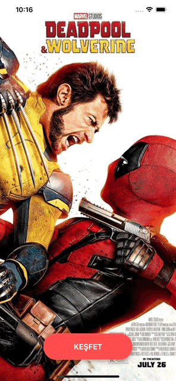
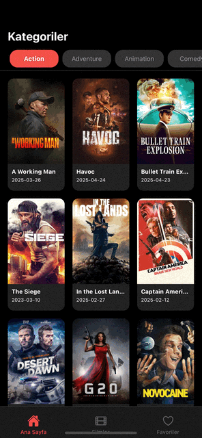
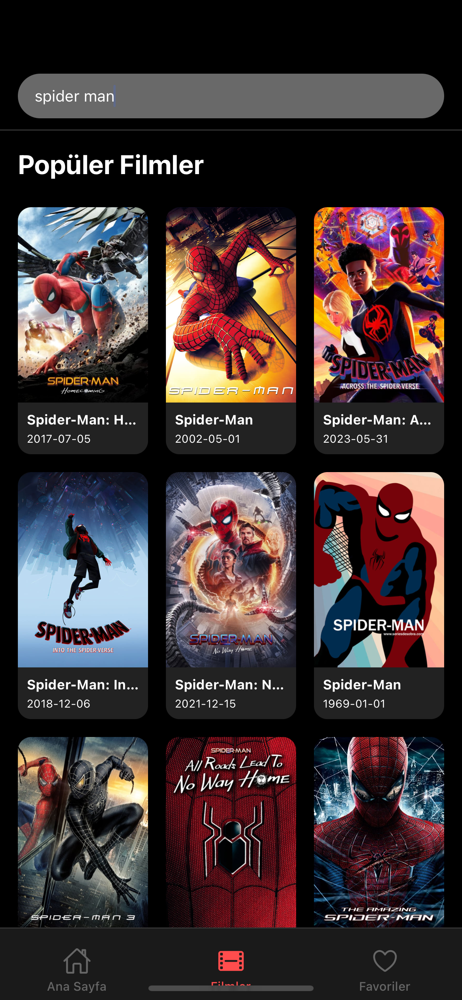
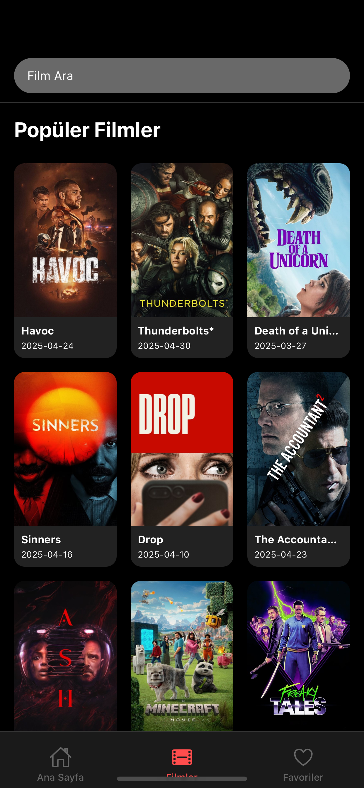
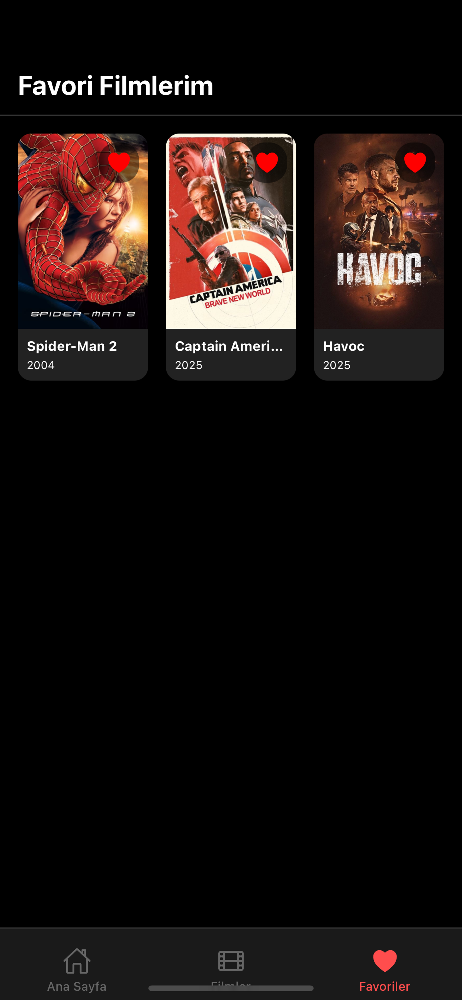
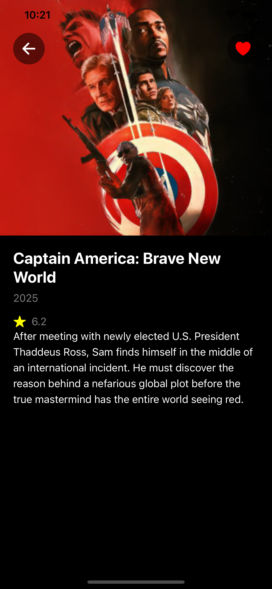

# MoviesApp/ReactNative 🍿

## Uygulama Ekranları 

  
  
  

  <b>Splah Screen</b>&nbsp;&nbsp;&nbsp;&nbsp;
  <b>Home Screen</b>&nbsp;&nbsp;&nbsp;&nbsp;
  <b>Search Screen</b>

  
  
  

  <b>Search1 Screen</b>&nbsp;&nbsp;&nbsp;&nbsp;
  <b>Favorite Screen</b>&nbsp;&nbsp;&nbsp;&nbsp;
  <b>Detail Screen</b>

## Kullanılan Teknolojiler 👨🏻‍💻

- **FlatList (horizontal)** – Ana sayfada yana doğru kayan kategoriler özelliği için kullanıldı.
- **Merkezi Renk Yönetimi (`Colors.ts`)** – Renkleri tek bir dosyada toplanarak, kolayca yönetilebilir ve değiştirilebilir hale getirildi.
- **Dinamik Splash Ekranı** – Uygulama açılışında, otomatik olarak değişen film görselleriyle kullanıcıya dinamik ve ilgi çekici bir karşılama ekranı sağlanmıştır.
- **Favorilere Ekleme ve Çıkarma** – Kullanıcılar, istedikleri filmleri favorilerine ekleyebilir veya çıkarabilir. Favori filmler, uygulama kapatılsa bile kaybolmaz; cihazda kalıcı olarak saklanır (AsyncStorage ile).
- **Sayfalar Arası Geçiş (router)** – Uygulama içinde farklı ekranlar arasında hızlı ve sorunsuz geçişler için `router` kullanılmıştır.
- **Axios** – API isteklerini gerçekleştirmek için kullanıldı.

## İletişim 💌
- ozturkkensar@gmail.com
- https://github.com/EnsarOzturk
- www.linkedin.com/in/ensar-öztürk-3aa986235
